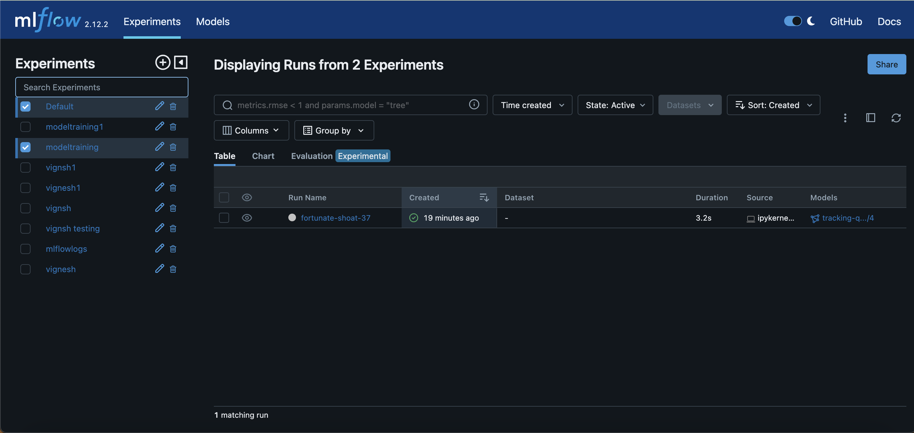

# mflowcdkinfra

This CDK help you to buld the mlflow software in your own aws infrastructure.

After your infra created execute the following two commands in your EC2 instance to install and start the mlflow software.

python3 -m pip install mlflow
mlflow server --host 0.0.0.0 --port 5000

